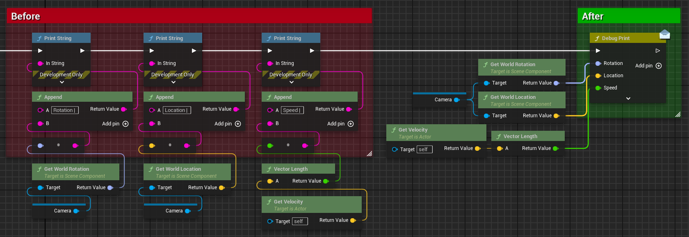
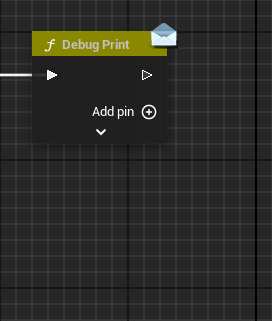
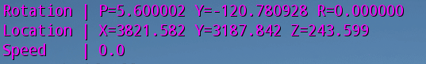
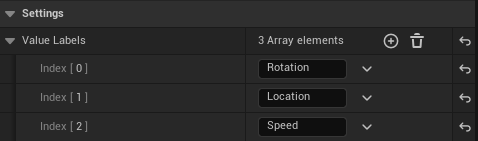
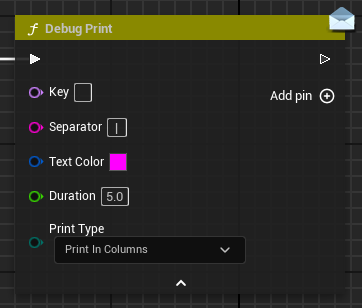

# DebugPrint

**DebugPrint** is a custom node that allows you to quickly and easily set up on-screen debug information for code testing in Unreal Engine.



This node extends the **K2_Node** class and leverages various interfaces available in the Blueprint Graph editor, such as Wildcards, Add Pin Button, EditablePinBase, and automatic pin creation through Drag and Drop operations. This level of automation greatly enhances the process of on-screen debugging.



## Output Formatting

**DebugPrint** offers various levels of formatting for your debug output, allowing you to tailor the display to your needs. Each formatting type inherits behavior from the one before it. For example, `PrintInColumns` provides the most advanced output, formatting variables into a table with labels and automatic updates.



For proper table formatting to work, make sure to select a **Monospace** font for **Small Font** in **Project Settings** > **Engine** > **General Settings**. This ensures that the columns align correctly when using the `PrintInColumns` option. Additionally, you may want to increase the **Small Font** size to make the debug messages more readable on screen.

| **Type**           | **Description**                                                              |
| ------------------ | ---------------------------------------------------------------------------- |
| **PrintInline**    | Prints all content in one line, like a standard Print String node.           |
| **PrintReplace**   | Prints in a single line but overwrites the content with each update.         |
| **PrintNewLine**   | Prints each value on a new line.                                             |
| **PrintLabels**    | Prints each value with a label to identify it.                               |
| **PrintInColumns** | Prints values in columns, aligning labels and keys for a table-like display. |

You can easily customize labels for each variable in the **Details** panel of the node.



## Node Default Settings

The **DebugPrint** node includes a dedicated section in the **Editor Settings** where you can adjust default values for the node when it is spawned. This is particularly useful if you have specific preferences for debug output settings, allowing you to configure them globally.



## Custom Structs Support

Since **DebugPrint** relies on wildcard pins, it does not automatically perform explicit conversions. Unreal Engine uses implicit conversion methods to turn variables into strings. However, if you have custom structs that you want to output in a readable way, it’s good practice to explicitly define how those structs convert to strings.

This can be achieved by creating **Blueprint Function Libraries** that include conversion functions for your custom structs. You can use the `BlueprintAutocast` specifier to ensure Unreal Engine knows how to handle the conversion when connecting your custom structs to the **DebugPrint** node.

### Steps to Create a Custom Struct Conversion

First, you need to define the struct that you want to convert to a string format.

```cpp
USTRUCT(BlueprintType)
struct FMyCustomStruct
{
    GENERATED_BODY()
    
    UPROPERTY(BlueprintReadWrite, EditAnywhere)
    FString Name;

    UPROPERTY(BlueprintReadWrite, EditAnywhere)
    int32 Age;

    UPROPERTY(BlueprintReadWrite, EditAnywhere)
    FLinearColor FavoriteColor;
};
```

Next, create a `Blueprint Function Library` that will contain the conversion function. This allows you to define how the struct should be formatted when converted to a string.

```cpp
UCLASS()
class YOURPROJECT_API UMyStructConversionLibrary : public UBlueprintFunctionLibrary
{
    GENERATED_BODY()

public:
    // This function converts the custom struct to a readable string.
    UFUNCTION(BlueprintPure, meta = (DisplayName = "ToString (MyCustomStruct)", CompactNodeTitle = "->", BlueprintAutocast), Category = "Utilities|String")
    static FString ConvertMyCustomStructToString(const FMyCustomStruct& MyStruct)
    {
        return FString::Printf(TEXT("Name: %s, Age: %d, Favorite Color: R=%f G=%f B=%f"), 
            *MyStruct.Name, MyStruct.Age, 
            MyStruct.FavoriteColor.R, MyStruct.FavoriteColor.G, MyStruct.FavoriteColor.B);
    }
};
```

After defining this function, it will be available to use in Blueprints. You can now connect your custom struct directly to the **DebugPrint** node, and Unreal Engine will automatically find the `BlueprintAutocast` function to convert the struct to a string.

## Setting Up a Convenient Shortcut

To streamline your workflow, you can assign a shortcut key to quickly spawn the DebugPrint node in the Blueprint editor. This can be configured by adding the following entry to your `DefaultEditorPerProjectUserSettings.ini` file, located in the `Config` folder of your project or the Unreal Engine directory.

Make sure no conflicting shortcut exists (e.g., "D" spawns the Delay node, "P" spawns Begin Play node).

```ini
[BlueprintSpawnNodes]
+Node=(Class=DebugPrint Key=X Shift=false Ctrl=false Alt=false)
```

This example binds the **DebugPrint** node to the "X" key.